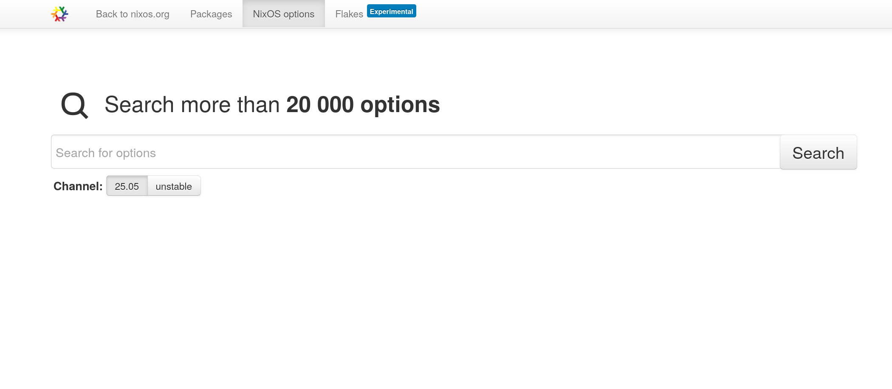
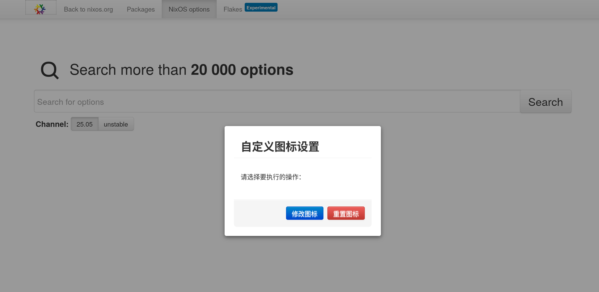

# 原因
因为骄傲月太长，Logo设计又不好看，为了真正的平等包容，实现了自定义图标的功能。

# 使用方法

打开 https://greasyfork.org/zh-CN/scripts/543198-searchnixos-logocustom （或者点击上面这个图标）

安装完成插件后，打开 https://search.nixos.org

右键点击左上角的 Nix 图标，会弹出功能菜单

点击 `修改图标` 按钮，可以从本地选择图标替换官方图标

点击 `重置图标` 按钮，可以清除已经设置的图标

点击空白处退出功能菜单

# Q&A

Q：为什么使用这么丑的UI

A：因为 https://search.nixos.org 使用的是 Bootstrap v2.3.2，和官方界面保持一致

---
Q：做这个还有什么原因？

A：社区里面一些人并不友善，特别是对于性少数议题。既然改成什么都会有人反对，那么不如自己来选择喜欢的图标。